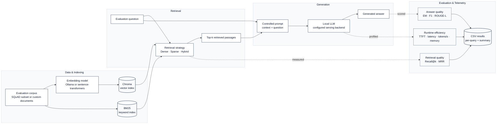

<div align="center">

# Local RAG Benchmark

<p><em>Privacy-preserving RAG benchmarking, entirely on your hardware</em></p>

**Compare small language models, embedding models, and retrieval strategies across quality, retrieval accuracy, latency, throughput, and memory — without requiring cloud inference.**

<p>
  <a href="#setup"><strong>Get Started</strong></a>
  ·
  <a href="#how-it-works"><strong>Architecture</strong></a>
  ·
  <a href="#experimental-design"><strong>Experimental Design</strong></a>
  ·
  <a href="#preliminary-benchmark-results"><strong>Results</strong></a>
  ·
  <a href="#reproducibility"><strong>Reproduce</strong></a>
  ·
  <a href="#citation"><strong>Cite</strong></a>
</p>

<p>
  
  
  
  <a href="LICENSE"></a>
  <a href="https://github.com/adnan425/local-rag-benchmark/stargazers"></a>
</p>

<p>
  
  
  
  
</p>

</div>

<table align="center">
  <tr>
    <td align="center"><strong>7</strong><br><sub>Local LLMs</sub></td>
    <td align="center"><strong>3</strong><br><sub>Embedding models</sub></td>
    <td align="center"><strong>3</strong><br><sub>Retrieval strategies</sub></td>
    <td align="center"><strong>63</strong><br><sub>Benchmark configurations</sub></td>
    <td align="center"><strong>6,300</strong><br><sub>Generations / full run</sub></td>
  </tr>
</table>

> [!IMPORTANT]
> **Local-first by design.** When inference and embedding endpoints are configured locally, documents, questions, embeddings, retrieved context, and generated responses remain inside your environment. Pointing an OpenAI-compatible backend to a remote server changes that privacy boundary.

<details>
<summary><strong>What does this benchmark evaluate?</strong></summary>
<br>

| Dimension | Measures |
|---|---|
| **Answer quality** | Exact Match, F1, ROUGE-L |
| **Retrieval quality** | Recall@k, MRR |
| **Generation performance** | TTFT, total latency, tokens/s |
| **Resource efficiency** | GPU / system memory footprint |
| **System variables** | LLM × embedding model × dense / sparse / hybrid retrieval |

</details>

## Why this project?

Many widely used RAG evaluations focus on large hosted models, while deployment constraints can be very different when inference must remain on-device or inside a private environment. This project focuses on a narrower deployment question:

> **How well can fully local RAG perform using small open-weight models that can run on a laptop or a single GPU?**

The benchmark is configuration-driven and sweeps combinations of language model, embedding model, and retrieval strategy under a controlled evaluation pipeline. Generation can run through **Ollama**, **llama.cpp**, **LM Studio**, **vLLM**, or another OpenAI-compatible local server; embeddings can be served through Ollama or generated locally with **sentence-transformers**.

The primary research benchmark fixes the serving backend so backend-specific implementation differences do not confound model comparisons. Additional backend support is provided for portability, reproducibility, and follow-up systems experiments.

## Contents

- [Setup](#setup)
- [Usage](#usage)
- [Supported backends](#supported-backends)
- [How it works](#how-it-works)
- [Experimental design](#experimental-design)
- [Preliminary benchmark results](#preliminary-benchmark-results)
- [Reproducibility](#reproducibility)
- [Limitations](#limitations)
- [Using your own documents](#using-your-own-documents)
- [Project layout](#project-layout)
- [Contributing](#contributing)
- [Citation](#citation)

## Setup

Requires Python 3.10+ and a local LLM server. [Ollama](https://ollama.com/download) is the fastest path to a first run; llama.cpp, LM Studio, and vLLM work the same way once they are serving a model (see [Supported backends](#supported-backends)).

```bash
git clone https://github.com/adnan425/local-rag-benchmark.git
cd local-rag-benchmark

python -m venv venv
source venv/bin/activate        # Windows: venv\Scripts\activate

pip install -r requirements.txt
bash scripts/setup_ollama.sh    # pulls the models used in configs/benchmark.yaml
```

On Windows without a bash shell, run the `ollama pull` commands inside `scripts/setup_ollama.sh` manually.

## Usage

```bash
python scripts/run_benchmark.py --config configs/benchmark.yaml
```

This runs every `(LLM × embedding model × retrieval strategy)` combination defined in the config against the QA set and writes:

- `results/benchmark_results.csv` — one row per question, including the raw model output
- `results/benchmark_summary.csv` — one row per configuration, averaged across the evaluation set

A full run with the default config is **7 models × 3 embedding models × 3 retrieval strategies × 100 questions = 6,300 generations**. For a quick validation run, reduce `n_questions` and trim the `llms` list in the config before launching the full sweep.

## Supported backends

The default config (`configs/benchmark.yaml`) uses Ollama. Generation can also target any OpenAI-compatible `/v1/chat/completions` server. Copy an entry from [`configs/backend_examples.yaml`](configs/backend_examples.yaml) into `llms:`; switching serving tools is a configuration change rather than a code change. The `openai` package used by `openai_compatible` is already listed in `requirements.txt`.

| Backend | Typical `base_url` | Notes |
|---|---|---|
| **Ollama** (native) | — | Default. Set `backend: ollama`. Per-model GPU memory is read from `ollama ps`. |
| **llama.cpp** server | `http://localhost:8080/v1` | Set `backend: openai_compatible`. |
| **LM Studio** | `http://localhost:1234/v1` | Use the Local Server tab; `name` must match the loaded model ID. |
| **vLLM** | `http://localhost:8000/v1` | Example: `vllm serve <model> --port 8000`. |
| **Ollama** (`/v1`) | `http://localhost:11434/v1` | OpenAI-shaped HTTP over the same local Ollama models. |

For `openai_compatible` backends, the GPU-memory column is based on a system-wide `nvidia-smi` reading rather than Ollama's per-model `ollama ps` value. It therefore reflects all GPU activity during the run and should be treated as an approximate signal.

TTFT is also not comparable across backends: Ollama reports prompt-evaluation time from the server, while llama.cpp, LM Studio, and vLLM measure time to the first streamed token.

Raw Hugging Face Transformers is not currently a benchmark backend. The project intentionally measures serving-based local inference and avoids adding device-placement and quantization logic that would introduce another implementation variable.

## How it works



The retrieval layer supports three strategies:

- **Dense** — embed the query and search the Chroma vector index
- **Sparse** — retrieve passages with BM25 keyword matching; no query embeddings are required
- **Hybrid** — combine dense and sparse retrieval using weighted score fusion (`retrieval.hybrid_alpha`, default `0.5`)

Generation uses whichever local LLM backend is configured. Embeddings can come from Ollama (`nomic-embed-text`, `qwen3-embedding:0.6b`) or from a local `sentence-transformers` backend (`all-MiniLM-L6-v2`) used as a CPU-only baseline.

The default corpus is a 200-passage subset of SQuAD's validation set. Its ground-truth question → passage → answer relationships allow retrieval quality to be measured directly rather than inferred from model answers alone. SQuAD is useful for controlled factual QA evaluation, but it does not represent every real-world document workload; see [Limitations](#limitations).

## Experimental design

The main research benchmark is designed to isolate three primary independent variables while keeping the rest of the evaluation pipeline controlled.

### Independent variables

| Variable | Compared configurations |
|---|---|
| **Language model** | Small local/open-weight LLMs defined in `configs/benchmark.yaml` |
| **Embedding model** | Local Ollama embeddings and a sentence-transformers CPU baseline |
| **Retrieval strategy** | Dense, sparse/BM25, and hybrid retrieval |

### Controlled variables

The main benchmark holds the following constant across comparable configurations:

- evaluation corpus and question set
- `top-k` retrieval depth
- prompt template and answer-format instruction
- generation settings such as temperature
- metric implementation
- benchmark harness
- hardware environment within a reported run

The repository supports multiple serving backends for portability and reproducibility. **Unless otherwise stated, the primary research benchmark fixes Ollama as the inference backend** so serving-stack differences do not confound comparisons between language models, embeddings, and retrieval strategies.

### Evaluation metrics

| Category | Metrics |
|---|---|
| **Answer quality** | Exact Match (EM), token F1, ROUGE-L |
| **Retrieval quality** | Recall@k, Mean Reciprocal Rank (MRR) |
| **Runtime efficiency** | Time to first token (TTFT), total latency, tokens/second. TTFT definitions differ by backend; see [Supported backends](#supported-backends). |
| **Resource usage** | GPU/model memory reporting where available |

## Preliminary benchmark results

> **Status:** These results are implementation-validation results, not the final research-paper experiment. The final study should use a larger evaluation set and repeated measurements where practical so variability can be reported.

These numbers come from one run on one machine and should be treated as a reference point rather than a universal ranking. Local inference performance depends on hardware, model quantization, runtime configuration, and available memory.

**Setup:** 200 SQuAD passages, 100 questions, seed 42. 7 LLMs × 3 embedding models × 3 retrieval strategies = 63 configurations, with a single run per configuration. NVIDIA RTX 5060 Laptop GPU (8 GB VRAM), Ollama on Windows.

Best `(embedding, retrieval strategy)` per model, ranked by F1:

| Model | Best config | EM | F1 | ROUGE-L | Recall@k | Latency | GPU mem |
|---|---|--:|--:|--:|--:|--:|--:|
| qwen3.5:9b | qwen3-embedding:0.6b + hybrid | 0.69 | 0.870 | 0.867 | 0.98 | 1.28s | 5.1 GB |
| qwen3.5:4b | nomic-embed-text + hybrid | 0.73 | 0.866 | 0.860 | 0.99 | 0.73s | 3.2 GB |
| gemma4:e4b | nomic-embed-text + hybrid | 0.65 | 0.850 | 0.853 | 0.99 | 0.64s | 3.1 GB |
| phi4-mini | nomic-embed-text + hybrid | 0.62 | 0.813 | 0.805 | 0.99 | 0.39s | 3.5 GB |
| phi4:14b | all-MiniLM-L6-v2 + dense | 0.62 | 0.813 | 0.810 | 0.97 | 2.08s | 5.9 GB* |
| ministral-3:3b | qwen3-embedding:0.6b + dense | 0.60 | 0.791 | 0.788 | 0.98 | 0.33s | 3.1 GB |
| llama3.2:3b | nomic-embed-text + hybrid | 0.53 | 0.730 | 0.717 | 0.99 | 0.34s | 3.0 GB |

\* `phi4:14b` has a total model size of roughly 10.5 GB, exceeding the 8 GB VRAM available on this machine. Part of the model therefore ran on CPU. Its latency and memory figures reflect that spillover rather than a fully GPU-resident run.

Averaged across all models:

| Metric | Dense | Sparse | Hybrid |
|---|--:|--:|--:|
| F1 | 0.800 | 0.724 | 0.803 |
| Recall@k | 0.973 | 0.870 | 0.980 |

On this corpus, hybrid retrieval slightly outperformed dense-only retrieval on both F1 and Recall@k, while both substantially outperformed sparse/BM25 retrieval. The three embedding models (`nomic-embed-text`, `qwen3-embedding:0.6b`, and `all-MiniLM-L6-v2`) were within 0.005 F1 of one another when averaged across the current benchmark.

Model size was not a reliable predictor of RAG quality in this run. `qwen3.5:4b` reached F1 0.866 compared with 0.870 for `qwen3.5:9b`, while using less latency and memory in this environment. This result is preliminary and should be validated under the final repeated-run protocol before drawing broader conclusions.

The system prompt also materially affects lexical metrics. The benchmark instructs models to answer with the shortest possible exact phrase. Without that constraint, explanation-prone models can receive lower EM/F1 even when their answers are factually correct because word-overlap metrics penalize additional text. Results should therefore only be compared when the same prompt and generation settings are used.

## Reproducibility

For every published benchmark run, record the software, hardware, dataset, and generation settings needed to reproduce the result. At minimum, report:

| Category | Record |
|---|---|
| **Hardware** | CPU, system RAM, GPU, VRAM |
| **Platform** | Operating system and architecture |
| **Runtime** | Python version, Ollama/backend version |
| **Models** | Exact model tags and quantization when known |
| **Embeddings** | Exact embedding model names/versions |
| **Dataset** | Dataset source/version, passage count, question count |
| **Retrieval** | strategy, `top-k`, hybrid fusion weight |
| **Generation** | system prompt, temperature, max tokens, reasoning/thinking mode |
| **Evaluation** | random seed(s), number of repeated runs, metric definitions |

The final research experiment should preserve these settings in configuration files wherever possible rather than relying on undocumented command-line or machine-specific state.

## Limitations

- **Single run per configuration.** The current preliminary benchmark has no repeated trials, so it does not provide a variance estimate. Latency in particular may fluctuate between runs; small differences should not be treated as meaningful without repeated measurements.
- **100 evaluation questions.** This is sufficient to validate the pipeline and obtain an initial directional result, but not enough for tight confidence intervals or strong generalization claims.
- **SQuAD is Wikipedia-style factual QA.** It does not represent longer, noisier, domain-specific, or ambiguous real-world documents such as contracts, clinical notes, policy manuals, or internal enterprise knowledge bases.
- **Prompt sensitivity.** EM/F1 and similar lexical metrics are affected by answer verbosity. The controlled short-answer prompt improves comparability but does not eliminate all metric limitations.
- **Reasoning-model output handling.** A local reasoning model (Qwen3, not currently in the default lineup) initially produced near-zero F1 because thinking-mode output was not separated from the final answer before scoring. The harness now strips `<think>...</think>` blocks and defaults to `think: false`, but other reasoning-hybrid models may require similar handling.
- **GPU memory and TTFT are not equivalent across backends.** Ollama memory comes from `ollama ps`; OpenAI-compatible backends use system-wide `nvidia-smi`. Ollama TTFT is prompt-evaluation time; other backends measure time to the first streamed token. Useful for relative comparison within one backend, not as a cross-stack ranking.
- **Privacy depends on deployment.** The benchmark supports remote-capable API shapes for interoperability. Privacy-preserving claims apply only when all configured inference and embedding services remain inside the intended local or trusted environment.

## Using your own documents

The SQuAD default exists so retrieval accuracy can be measured out of the box, but swapping in a custom corpus is straightforward:

1. Put `.txt` files in `data/corpus/`.
2. Add `data/qa_pairs.jsonl`, one JSON object per line:

   ```json
   {"question": "...", "answer": "...", "gold_passage_id": "..."}
   ```

3. Set `dataset.source: custom` in `configs/benchmark.yaml`.

If no gold passage labels are available, leave `gold_passage_id` empty. The benchmark can still report answer quality and runtime/resource metrics, but Recall@k and MRR cannot be computed without retrieval relevance labels.

## Project layout

```text
src/
  models.py        LLM backends, thinking-mode handling, memory reporting
  embeddings.py    Ollama and sentence-transformers embedding backends
  vectorstore.py   Chroma wrapper
  retrieval.py     dense / sparse (BM25) / hybrid retrieval
  dataset.py       corpus and QA loading
  metrics.py       EM / F1 / ROUGE-L, Recall@k / MRR
  benchmark.py     experiment sweep orchestration

configs/
  benchmark.yaml          full experiment matrix
  backend_examples.yaml   alternative local serving backends

scripts/
  run_benchmark.py
  setup_ollama.sh

results/           per-query and summary CSV output
data/              optional custom corpus and QA data
```

## Contributing

Issues and pull requests are welcome, particularly for:

- benchmark results from other hardware, including Apple Silicon, CPU-only systems, and larger GPUs
- additional retrieval strategies, especially reranking
- evaluation corpora beyond SQuAD
- results from llama.cpp, LM Studio, or vLLM using comparable model tags and settings

Fork the repository, create a branch, and open a pull request. When contributing benchmark results, include enough hardware and configuration metadata for others to interpret and reproduce the run.

## Citation

```bibtex
@misc{localragbenchmark2026,
  title  = {Benchmarking Small Language Models for Privacy-Preserving Local Retrieval-Augmented Generation},
  author = {Adnan},
  year   = {2026},
  url    = {https://github.com/adnan425/local-rag-benchmark}
}
```

## License

MIT — see [LICENSE](LICENSE).